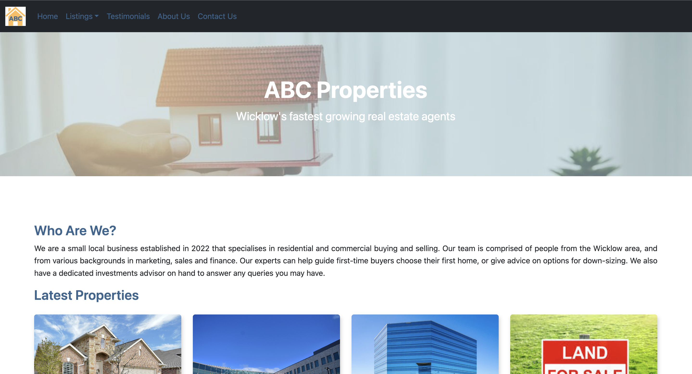
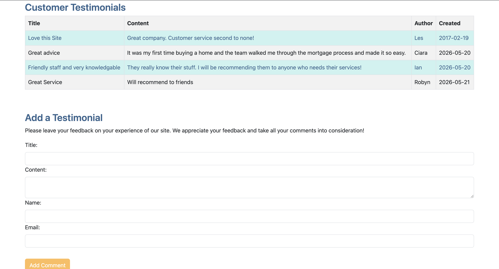
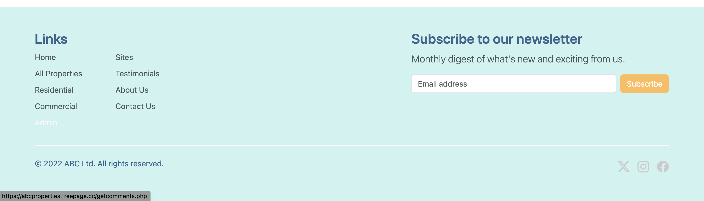
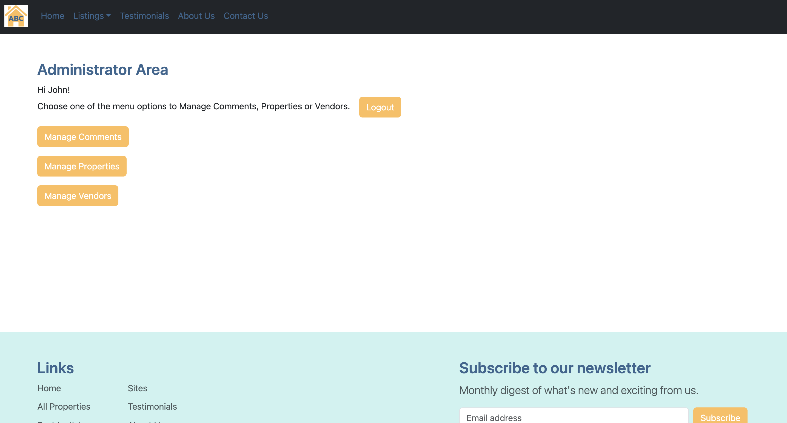
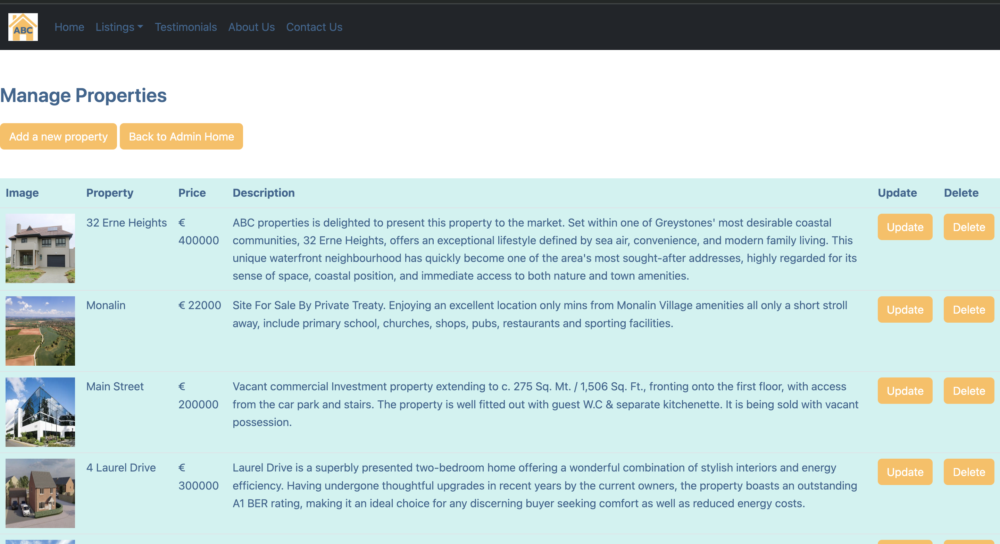

# Real Estate Website

A responsive property management web application developed using PHP, MySQL, Bootstrap, HTML and CSS. The application allows administrators to manage property listings through a secure interface while providing visitors with an intuitive property browsing experience.

## Live Demo

https://abcproperties.freepage.cc

## Technologies Used

* PHP
* MySQL
* HTML5
* CSS3
* Bootstrap 5
* XAMPP (development environment)
* Git & GitHub

## Features

### Property Management

* Create, read, update and delete (CRUD) property listings
* Upload and manage property images
* Store property details in a MySQL database

### Administration

* Secure administrator login
* Protected management interface
* Database-driven content management

### User Experience

* Responsive design for desktop and mobile devices
* Consistent UI using Bootstrap components
* Property browsing and viewing functionality

### Newsletter Subscription

* Email subscription form
* Server-side email validation
* Prevention of duplicate subscriptions
* Subscriber information stored in MySQL

## Screenshots

### Homepage


### Testimonials


### Footer with Newsletter


### Admin Dashboard


### Admin Property Listing Management


## Database

The application uses MySQL to store:

* Property listings
* Administrator account information
* Newsletter subscribers

## Development Challenges

During deployment from a local XAMPP environment to a live hosting environment, several issues were identified and resolved, including:

* Database connectivity configuration
* Image path and file handling issues
* Email subscription validation
* Hosting environment differences between Windows and Linux

## Installation

1. Clone the repository

```bash
git clone https://github.com/robyn-ryan/RealEstateWebsite.git
```

2. Import the SQL database into MySQL.

3. Update database credentials in `connect.php`.

4. Start Apache and MySQL.

5. Open the project in your browser.

## Future Improvements

* Property search and filtering
* Password hashing for administrator accounts
* Email confirmation for newsletter subscriptions
* REST API integration
* Docker containerisation
* Automated testing

## Author

Robyn Ryan

LinkedIn: linkedin.com/in/robyn-ryan
GitHub: github.com/robyn-ryan
